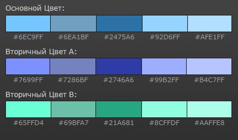

# Экзаменационная работа по дисциплине МДК 05.02 "Разработка кода информационных систем"
## Работу выполнил: Михальченко Григорий
Группа: 223
Номер билета: 2

### Цветовая схема экзаменационной работы

#### Мануальное тестирование
1.СЦЕНАРИЙ. Цель: проверить корректность работы поля ввода "Имя Фамилия". Сценарий: захожу на сайт, проверяю факт создания элемента, ввожу текст "Иван Иванович" в формате "Имя Фамилия". Итог: введённое значение корректно и форма принимает его. Тест пройден
2.СЦЕНАРИЙ. Цель: проверить корректность обработки ошибочного значения в поле ввода "Имя Фамилия". Сценарий: захожу на сайт, проверяю факт создания элемента, ввожу текст "ИванИванович". Итог: введённое значение некорректно и форма выдает ошибку "Пожалуйста, введите корректное ФИО (хотя бы два слова кириллицей)". Тест пройден
3.СЦЕНАРИЙ. Цель: проверить корректность работы поля ввода "+7 (900) 123-45-67". Сценарий: захожу на сайт, проверяй факт наличия элемента, ввожу номер "+79001234567". Итог: введённое значение корректно и форма принимает его. Тест пройден 
4.СЦЕНАРИЙ. Цель: проверить корректность работы поля ввода "example@example.com". Сценарий: захожу на сайт, проверяю факт наличия элемента, ввожу текст "example@example.com". Итог: введённое значение корректно и форма принимает его. Тест пройден
5.СЦЕНАРИЙ. Цель проверить корректность обработки ошибочного значения в поле ввода "дд.мм.гггг". Сценарий: захожу на сайт, проверяю факт наличия элемента, выбираю дату "28.06.2024". Итог: введённое значение корректно, но дата стоит будующим числом, форма выдает ошибку "Пожалуйста, введите дату, которая как минимум следующий день от текущего". Тест пройден

